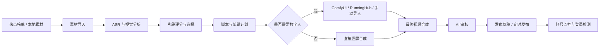
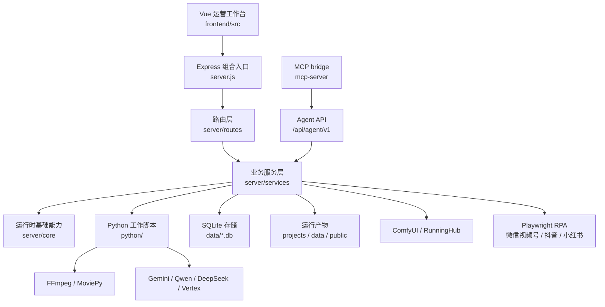

# TrendCut Studio

<p align="center">
  <strong>热点短视频剪辑、审核与发布的本地工作台</strong>
</p>

<p align="center">
  <a href="https://github.com/HQAmenghen/TrendCut-Studio"></a>
  <a href="https://gitee.com/HQAmenghen/TrendCut-Studio"></a>
  <a href="https://github.com/HQAmenghen/TrendCut-Studio/stargazers"></a>
  
  
  
  
  
</p>

TrendCut Studio 是一个面向内容运营场景的本地自动化工作台。项目把热点发现、素材分析、脚本生成、数字人口播、视频合成、AI 审核、发布任务、账号状态监控和系统自检整合到同一个 Node.js + Vue + Python 工作区中。

项目适合运行在可信任的本地机器上。ComfyUI、RunningHub、LLM 服务、FFmpeg、Playwright 浏览器、平台账号登录状态和发布凭证均作为外部运行依赖，由使用者自行配置和维护。

## 核心能力

| 模块 | 说明 |
| --- | --- |
| 热点发现 | 支持 xAI/X 热点榜单、分区配置、榜单刷新、关键词搜索、候选素材筛选和摘要翻译。 |
| 素材驱动生产 | 支持本地视频或视频 URL 输入，自动完成 ASR、视觉理解、片段评分、脚本生成、剪辑计划和项目产物落盘。 |
| 数字人口播 | 支持手动导入数字人视频，也支持通过 ComfyUI 或 RunningHub 兼容流程生成数字人素材。 |
| 视频合成 | 支持素材驱动最终成片、无数字人竖屏转换、独立竖屏任务、素材任务导入、字幕、标题卡和片尾配置。 |
| AI 审核 | 支持成片质量审核、审核历史、问题建议、跳过审核、按建议重新生成等流程。 |
| 发布中心 | 支持发布素材管理、平台草稿、定时发布、微信视频号 RPA、多平台账号状态和失败任务追踪。 |
| 系统运维 | 支持依赖自检、结构化错误、任务恢复、定时调度、清理规则、飞书通知、登录检测和运行产物边界保护。 |
| Agent / MCP | 提供本地 Agent API 与 MCP bridge，便于 MCP 客户端在授权后调用热点、生产、审核、发布等工作流工具。 |

## 主流程



每个素材驱动任务都会在 `projects/material_<jobId>/` 下形成独立项目目录，保存源素材、ASR 结果、视觉分析、片段选择、口播稿、剪辑计划、数字人产物和最终视频。这种以文件系统为主的产物结构便于排查、恢复和人工接管。

## 系统架构



| 层级 | 主要位置 | 职责 |
| --- | --- | --- |
| 前端工作台 | `frontend/src/App.vue`, `frontend/src/components/AutomationDashboard.vue`, `frontend/src/composables/` | 操作界面、任务状态、SSE 进度、审核、发布和本地恢复状态。 |
| Express 入口 | `server.js` | 环境加载、中间件、静态资源、服务装配、路由注册、调度器和恢复服务启动。 |
| 路由层 | `server/routes/` | 对外暴露素材生产、审核、发布、系统设置、竖屏队列、热点榜单、登录状态和 Agent API。 |
| 服务层 | `server/services/` | 工作流编排、数据访问、外部服务集成、账号看板、调度、清理和恢复。 |
| 基础运行层 | `server/core/` | Python 进程执行、任务存储、进度流、结构化错误、清理、恢复和任务协议。 |
| Python 脚本 | `python/pipeline/`, `python/review/`, `python/publish/`, `python/xai/` | ASR、视觉理解、剪辑计划、媒体渲染、审核、RPA 和热点发现。 |
| MCP 集成 | `server/services/agent/`, `server/routes/agent.js`, `mcp-server/` | 基于 Token 的本地自动化接口和 MCP 工具封装。 |

## 技术栈

| 类别 | 技术 |
| --- | --- |
| 前端 | Vue 3, Vite, CSS, lucide-vue-next |
| 后端 | Node.js 18+, Express, better-sqlite3, node-cron, ws, multer |
| Python | Python 3.10+, MoviePy, faster-whisper, Pillow, Playwright, requests/httpx |
| AI 与模型服务 | Gemini, Qwen/DashScope, DeepSeek, Vertex AI, xAI 兼容 OpenAI transport |
| 媒体处理 | FFmpeg, ComfyUI, RunningHub 兼容数字人流程 |
| 数据存储 | SQLite, JSON 文件, 项目目录, 本地文件系统 |
| 自动化 | Playwright RPA, vendored `social-auto-upload` 子集, MCP bridge |
| 质量保障 | Jest, Python unittest, ESLint, Vite build, npm production audit, Python lock check |

## 快速开始

### 环境要求

- Node.js 18+
- npm
- Python 3.10+
- pip
- FFmpeg，并确保可在 `PATH` 中访问
- 如使用自动数字人生成，需要可访问的 ComfyUI 或 RunningHub 兼容服务
- 至少配置一个可用的 LLM Provider
- 如使用平台发布自动化，需要安装 Playwright 浏览器并完成账号登录

### 安装依赖

```powershell
git clone https://github.com/HQAmenghen/TrendCut-Studio.git
cd TrendCut-Studio

npm install
pip install -r requirements.lock.txt
python -m playwright install chromium
```

### 配置环境变量

```powershell
Copy-Item config/env.example .env
```

常用配置：

| 变量 | 用途 |
| --- | --- |
| `COMFYUI_BASE_URL` | ComfyUI 服务地址。 |
| `LLM_PROVIDER` | 主 LLM Provider 选择。公开模板默认使用 `qwen`。 |
| `QWEN_API_KEY` / `DASHSCOPE_API_KEY` | Qwen / DashScope 凭证。 |
| `XAI_API_KEY` | 热点发现凭证。 |
| `AGENT_API_TOKEN` | Agent API 与 MCP bridge 使用的本地访问 Token。 |
| `AI_REVIEW_ENABLED` | 是否启用 AI 审核。 |
| `FEISHU_WEBHOOK_URL` | 可选的飞书通知 Webhook。 |
| `LOGIN_CHECK_ENABLED` | 是否启用定时登录检测。 |

`config/env.example` 只保留开源运行的最小配置和常用可选项。Gemini、Vertex、DeepSeek、多 Key failover、OSS、素材库、TTS 等高级配置仍由代码支持，但不作为公开模板的默认内容。完整配置说明见 [docs/SETUP_AND_OPERATIONS.md](docs/SETUP_AND_OPERATIONS.md)。

### 启动服务

```powershell
npm start
```

默认访问地址：

```text
http://localhost:3001
```

前端开发模式：

```powershell
npm run dev:front
```

前端生产构建：

```powershell
npm run build:front
```

## MCP 与 Skill 说明

项目包含两类与 MCP/Skill 相关的内容：

| 内容 | 是否为运行时代码 | 说明 |
| --- | --- | --- |
| `mcp-server/` | 是 | MCP bridge，将本地 Agent API 包装成 MCP tools。 |
| `server/routes/agent.js` | 是 | Agent API HTTP 路由，路径前缀为 `/api/agent/v1`。 |
| `server/services/agent/` | 是 | Agent API 的鉴权、能力表、审计日志和业务处理。 |
| `.agents/skills/video-assistant-agent/` | 否 | 本地开发环境中的 Skill 使用说明，用来描述 MCP 客户端应如何选择工具。公开仓库不依赖该目录运行。 |

当前 MCP bridge 暴露 53 个工具，覆盖以下类别：

| 类别 | 示例工具 |
| --- | --- |
| 健康检查与能力发现 | `health_check`, `list_capabilities` |
| 热点榜单 | `list_hotspot_partitions`, `refresh_hotspot_leaderboard`, `list_hotspot_leaderboard`, `search_posts`, `find_post_by_rank` |
| 素材驱动生产 | `generate_video_from_post`, `generate_video_from_rank`, `generate_narration_from_post`, `get_job_status`, `get_workflow_next_actions` |
| 口播与数字人断点 | `get_narration_draft`, `revise_narration_draft`, `generate_avatar_video`, `generate_avatar_video_with_runninghub`, `get_avatar_status`, `preview_avatar_video` |
| 最终渲染与竖屏转换 | `render_final_video`, `continue_workflow_one_click`, `create_direct_vertical_video`, `create_no_avatar_vertical_video`, `create_vertical_video_from_material_job` |
| AI 审核 | `review_video`, `review_generated_video`, `list_review_history`, `get_review_record` |
| 发布流程 | `list_publish_assets`, `create_publish_draft`, `create_wechat_publish_draft`, `create_multi_platform_publish_draft`, `list_scheduled_publish_tasks`, `confirm_publish` |
| 账号与登录状态 | `get_publish_account_dashboard`, `list_publish_account_jobs`, `list_login_statuses`, `get_login_qrcode` |

详细说明见 [docs/MCP_AGENT_INTEGRATION.md](docs/MCP_AGENT_INTEGRATION.md)。

## 项目结构

```text
trendcut-studio/
├─ server.js                  # Express 组合入口
├─ frontend/                  # Vue 运营工作台源码
├─ server/                    # 路由、服务和运行时基础模块
├─ python/                    # 素材生产、审核、发布和热点脚本
├─ mcp-server/                # Agent API 的 MCP bridge
├─ config/                    # 工作流和运行配置
├─ docs/                      # 长期维护文档
├─ contracts/                 # 共享协议和 schema
├─ scripts/                   # CI、守卫和维护脚本
├─ vendor/                    # vendored social-auto-upload 子集
├─ Dockerfile
└─ docker-compose.yml
```

以下内容属于本地运行产物或个人工作区内容，不应进入公开仓库：

- `data/`
- `projects/`
- `frontend-dist/`
- `public/presets/`
- `.env` 与本地密钥
- 浏览器 Profile、Cookie、数据库、日志、生成视频和账号状态文件
- `.agents/`, `.claude/`, `.gitee/`, `.planning/` 等个人工具或过程管理目录

## 质量检查

```powershell
npm run lint
npm test
npm run test:py
npm run build:front
npm run audit:prod
npm run check:py-lock
```

仓库包含 pre-commit / pre-push 守卫和 CI 检查，用于阻止数据库、浏览器 Profile、生成视频、本地密钥和构建产物等运行文件进入版本库。

## Docker

```powershell
docker compose up --build
```

容器负责运行 Node 服务并提供前端静态资源。ComfyUI、模型服务、平台账号、浏览器登录状态和实际发布环境仍需要在部署目标中单独配置。

## 文档

- [功能总览](docs/FEATURES.md)
- [架构与重构指南](docs/ARCHITECTURE_AND_REFACTOR_GUIDE.md)
- [素材驱动工作流](docs/MATERIAL_DRIVEN_WORKFLOW.md)
- [MCP 与 Agent 集成](docs/MCP_AGENT_INTEGRATION.md)
- [API 概览](docs/API_OVERVIEW.md)
- [部署与运维](docs/SETUP_AND_OPERATIONS.md)
- [运行产物边界](docs/RUNTIME_ARTIFACTS_AND_BOUNDARIES.md)

## 协作

| 角色 | 说明 |
| --- | --- |
| HQAmenghen | 项目设计、产品方向、核心流程实现与维护。 |
| Claude | 辅助代码实现、问题排查、文档整理与方案讨论。 |
| OpenAI Codex | 辅助代码实现、结构梳理、测试验证与发布准备。 |

本项目包含 AI-assisted development 工作流。AI 工具用于提高实现、审查、重构和文档整理效率，最终设计取舍、代码合并和发布责任由项目维护者确认。

## Star History

[](https://www.star-history.com/#HQAmenghen/TrendCut-Studio&Date)

## License

TrendCut Studio 使用 MIT License 发布。

第三方 vendored 代码说明见 [THIRD_PARTY_NOTICES.md](THIRD_PARTY_NOTICES.md)。
