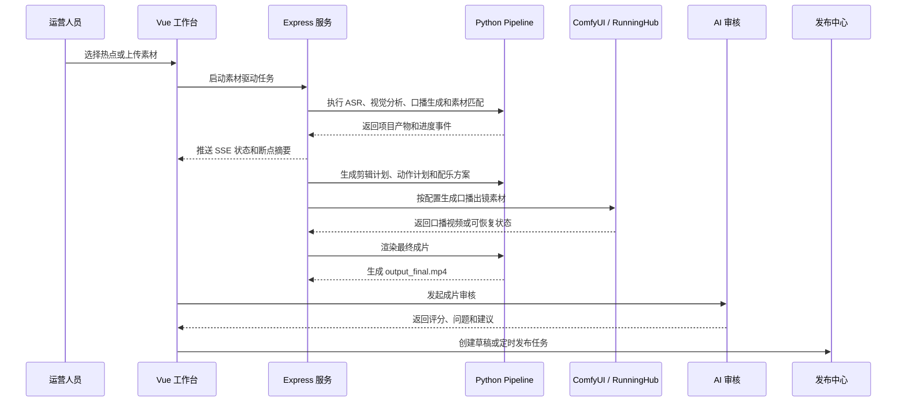

# 功能总览

TrendCut Studio 的核心目标是把“热点或素材”转成“可审核、可发布的短视频产物”。系统围绕本地运营人员的实际流程组织，重点不只是生成视频，还包括口播脚本、素材向量匹配混剪、自动配乐、口播动作控制、任务恢复、审核、发布、账号状态和运行安全边界。

## 能力矩阵

| 能力 | 用户结果 | 主要实现 |
| --- | --- | --- |
| 热点发现 | 查看、刷新、搜索分区热点，并选择适合视频化的帖子。 | `server/routes/xai.js`, `server/services/xai/service.js`, `python/xai/run_xai_top10.py`, `python/xai/translate_result_summaries.py` |
| 口播驱动生产 | 将热点或本地素材转成结构化口播稿、脚本单元、剪辑计划和最终成片项目目录。口播稿是后续混剪、配乐、动作和审核的主线。 | `server/routes/materialDriven.js`, `server/services/materialDriven/`, `python/pipeline/run_material_driven.py` |
| ASR 与视觉分析 | 从源视频提取音频转写、画面理解和可用素材信息。 | `python/pipeline/run_asr.py`, `python/pipeline/asr_filetrans.py`, `python/pipeline/video_vlm.py` |
| 素材向量匹配混剪 | 将口播单元与素材片段做语义匹配，选择更贴合脚本语义和节奏的画面。 | `python/pipeline/segment_material.py`, `python/pipeline/score_material_segments.py`, `python/pipeline/select_material_segments.py`, `python/pipeline/skills/vector_retriever.py` |
| 脚本与剪辑计划 | 将口播单元、素材匹配结果和画面穿插规则转为渲染指令。 | `python/pipeline/planner/`, `python/pipeline/skills/`, `python/pipeline/prompt_skills/` |
| 自动配乐 | 根据脚本节奏、视频类型和剪辑计划选择背景音乐，并参与最终合成。 | `python/pipeline/skills/music_selector.py`, `config/music_index.json`, `python/pipeline/smart_video_composer.py` |
| 口播出镜与动作控制 | 支持真人口播、手动导入口播视频，也支持 ComfyUI / RunningHub 兼容流程生成数字人口播素材，并维护口播分段、动作语义和画面节奏的对应关系。 | `server/services/materialDriven/avatarGeneration.js`, `server/services/materialDriven/avatarMotion.js`, `python/pipeline/avatar_motion_plan.py`, `server/services/pipeline/runningHub.js` |
| 最终视频合成 | 根据执行计划、素材片段、字幕、配乐和口播出镜产物渲染最终视频。 | `python/pipeline/smart_video_composer.py`, `server/services/materialDriven/pipelineProcess.js` |
| 无口播出镜竖屏分支 | 从源视频、URL 或已完成素材任务生成竖屏视频。 | `server/services/vertical/standalone.js`, `server/services/vertical/queue.js`, `python/pipeline/make_vertical_video.py` |
| AI 审核 | 对成片进行质量审核，保存历史记录，并给出修改建议。 | `server/routes/review.js`, `server/services/review/`, `python/review/ai_video_review.py` |
| 发布中心 | 管理可发布素材、生成文案、创建发布任务、执行定时发布和查看账号结果。 | `server/routes/publish.js`, `server/services/publish/`, `frontend/src/composables/usePublishCenter.js` |
| 微信视频号 RPA | 自动执行微信视频号登录检测、二维码获取和发布任务。 | `server/services/publish/wechatRpa*.js`, `python/publish/wechat_channels_rpa.py`, `python/publish/wechat_check_login.py` |
| 抖音和小红书适配 | 复用 vendored uploader 逻辑，接入更多平台发布能力。 | `server/services/publish/platformRpa.js`, `python/publish/social_auto_upload_adapter.py`, `vendor/social-auto-upload/` |
| 账号监控 | 查看登录状态、账号失败、最近任务和二维码登录支持。 | `server/services/publish/accountDashboard.js`, `server/services/notification/loginStatus.js`, `server/routes/loginStatus.js` |
| 定时调度与 AutoPilot | 处理定时发布、清理、登录检测和自动化队列衔接。 | `server/services/system/scheduler*.js` |
| 恢复与清理 | 对中断任务进行标记、重试、取消、恢复，并按规则清理过期产物。 | `server/core/recovery.js`, `server/core/cleanup.js`, `server/core/taskStore.js` |
| Agent / MCP / Skill | 通过 Token 保护的 Agent API、MCP bridge 和 Skill 使用说明，把生产流程整理成可被 AI coding 工具调用的工作流入口。 | `server/routes/agent.js`, `server/services/agent/`, `mcp-server/` |

## 生产主链路

## 运营流程

| 流程 | 起点 | 终点 | 恢复方式 |
| --- | --- | --- | --- |
| 热点生成完整视频 | xAI 分区榜单或指定帖子 | `projects/material_<jobId>/output_final.mp4` | SQLite 任务状态与项目目录双重记录。 |
| 本地素材生成视频 | 上传文件或素材 URL | 包含口播、素材匹配、计划、配乐、口播出镜、字幕和最终视频的项目目录 | 支持 continue、retry、rebuild、rerender。 |
| 先审口播稿 | 榜单帖子或源素材 | 可人工调整的口播草稿和脚本单元 | 口播稿可在口播出镜生成和最终渲染前修订。 |
| 无口播出镜竖屏 | 视频 URL、本地文件或素材任务 | 竖屏输出文件 | 队列状态记录和重试支持。 |
| AI 审核 | 已完成视频 | 审核记录、问题列表和修改建议 | 审核历史与按建议重生成流程。 |
| 发布草稿 | 可发布素材或已完成任务 | 平台草稿或定时发布任务 | 发布任务持久化并记录平台状态。 |
| 账号登录检测 | 发布中心或定时调度 | 缓存登录状态和可选二维码截图 | 登录状态缓存与飞书通知。 |

## 关键运行产物

| 文件 | 用途 |
| --- | --- |
| `projects/material_<jobId>/material.mp4` | 单个生产任务的源素材。 |
| `audio.json` | ASR 转写和时间轴信息。 |
| `result.json` | 视觉理解结果。 |
| `selected_segments.json` | 被选中的素材片段。 |
| `script_units.json` | 后续口播与渲染使用的结构化脚本单元。 |
| `narration.json` | 口播文本和相关元数据。 |
| `edit_plan.json` | 剪辑决策和穿插画面计划。 |
| `execution_plan.json` | 可直接用于渲染的合成指令。 |
| `aiman.mp4` | 当前工作流协议中的口播出镜视频产物。 |
| `avatar_segments.json` | 口播出镜内容与画面片段的映射关系。 |
| `output_final.mp4` | 素材驱动任务最终成片。 |

## 安全与边界

- Agent/MCP 中的草稿创建与真实发布分离。
- `confirm_publish` 属于高风险工具，需要显式确认和服务端开关。
- Git hooks 与 CI 会拦截常见运行产物、本地密钥、浏览器 Profile、数据库和生成视频。
- 系统自检会在生产任务前暴露缺失依赖，例如 Python、FFmpeg、Playwright、ComfyUI 配置。
- 长任务通过结构化协议输出阶段、结果和错误信息。
- 恢复逻辑会把僵死任务标记为 interrupted，而不是静默丢弃状态。

## 当前定位

TrendCut Studio 是本地控制台应用，不是多租户云服务。项目默认操作者拥有本机、文件系统、浏览器 Profile 和外部服务凭证的控制权。运行产物、账号状态、日志、密钥和个人工具目录应与源码仓库保持隔离。
