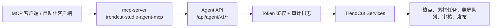

# MCP 与 Agent 集成

TrendCut Studio 提供一套本地自动化接口，供 MCP 客户端或其他受控自动化程序调用。该能力由两层组成：

1. Agent API：位于 `/api/agent/v1/*` 的 Token 鉴权 HTTP 接口。
2. MCP bridge：位于 `mcp-server/`，把 Agent API 封装为 MCP tools。

开发工作区中可能存在 `.agents/skills/video-assistant-agent/`。它是本地 Skill 使用说明，不是应用运行所需代码。公开项目只需要保留 MCP/Agent 的架构说明和运行代码，不需要发布个人助手配置目录。

## 组件关系



| 组件 | 路径 | 作用 |
| --- | --- | --- |
| Agent routes | `server/routes/agent.js` | 声明 `/api/agent/v1/*` HTTP 接口。 |
| Agent auth | `server/services/agent/auth.js` | 校验 `AGENT_API_TOKEN`，可在显式配置后允许 loopback 本地免鉴权。 |
| Agent audit log | `server/services/agent/auditLog.js` | 记录通过 Agent API 发起的请求。 |
| Agent handlers | `server/services/agent/handlers.js` | 把 Agent 请求转发到热点、素材、竖屏、审核、发布、登录和账号服务。 |
| Capability registry | `server/services/agent/capabilities.js` | 维护 V0 工具面、端点映射、风险级别和能力描述。 |
| MCP bridge | `mcp-server/src/server.js`, `mcp-server/src/tools.js` | 将 Agent API 操作发布为 MCP tools。 |
| Local skill guide | `.agents/skills/video-assistant-agent/SKILL.md` | 本地工具使用说明，描述自然语言意图应选择哪个 MCP tool。 |

## 鉴权

MCP bridge 会从进程环境或项目 `.env` 中读取 `AGENT_API_TOKEN`。同一个 Token 需要被 Node 服务接受。

```powershell
AGENT_API_TOKEN=replace-with-a-local-token
```

除非明确开启本地 loopback 免鉴权，否则 Agent API 会拒绝缺少 Token 的请求。若机器被多人共用，或端口可能被其他设备访问，应保持 Token 鉴权开启。

## 启动 MCP Bridge

安装根目录依赖和 MCP 依赖：

```powershell
npm install
cd mcp-server
npm install
```

启动 TrendCut Studio：

```powershell
npm start
```

启动 MCP bridge：

```powershell
cd mcp-server
npm start
```

默认后端地址：

```text
http://127.0.0.1:3001
```

如需覆盖后端地址：

```powershell
$env:TRENDCUT_STUDIO_AGENT_BASE_URL="http://127.0.0.1:3001"
```

## 工具分组

当前 MCP bridge 暴露 53 个工具。

| 分组 | 工具 |
| --- | --- |
| 健康检查与能力发现 | `health_check`, `list_capabilities` |
| 热点分区与帖子 | `list_hotspot_partitions`, `get_hotspot_refresh_status`, `refresh_hotspot_leaderboard`, `list_hotspot_leaderboard`, `list_video_ready_posts`, `search_posts`, `find_post_by_rank` |
| 素材驱动生产 | `generate_video_from_post`, `generate_video_from_rank`, `generate_narration_from_post`, `generate_narration_from_rank`, `get_job_status`, `get_workflow_next_actions`, `summarize_job_status`, `preview_generated_video` |
| 口播与数字人断点 | `get_narration_draft`, `revise_narration_draft`, `update_avatar_render_config`, `generate_avatar_video`, `generate_avatar_video_with_runninghub`, `get_avatar_status`, `preview_avatar_video` |
| 最终渲染与竖屏输出 | `render_final_video`, `continue_workflow_one_click`, `list_vertical_jobs`, `get_vertical_job_status`, `list_material_tasks`, `create_vertical_video_from_post`, `create_vertical_video_from_rank`, `create_direct_vertical_video`, `create_no_avatar_vertical_video`, `create_vertical_video_from_material_job` |
| AI 审核 | `review_video`, `review_generated_video`, `list_review_history`, `get_review_record` |
| 发布草稿与定时任务 | `list_publish_assets`, `create_publish_draft`, `create_wechat_publish_draft`, `create_multi_platform_publish_draft`, `list_publish_drafts`, `get_publish_schedule_summary`, `list_scheduled_publish_tasks`, `get_publish_task_status`, `confirm_publish` |
| 账号与登录 | `get_publish_account_dashboard`, `list_publish_account_jobs`, `list_publish_account_failures`, `list_login_statuses`, `get_login_status`, `get_login_qrcode` |

## 风险分级

| 风险级别 | 含义 | 示例 |
| --- | --- | --- |
| Low | 只读或状态查询。 | 健康检查、任务状态、账号看板、审核历史。 |
| Medium | 会启动本地任务、写入项目状态或打开浏览器自动化，但不会直接完成真实发布。 | 刷新热点榜单、生成口播、创建竖屏视频、创建发布草稿、获取二维码。 |
| High | 在服务端允许的情况下可能触发不可逆外部动作。 | `confirm_publish` |

V0 工具面刻意不开放大范围配置写入、批量删除、原始浏览器控制和无确认真实发布。

## Skill Guide 的定位

`.agents/skills/video-assistant-agent/` 目录的作用是给本地 MCP 客户端提供工具选择说明。它描述“用户说什么话时，应调用哪类 MCP tool”，不承载业务逻辑。

| 用户意图 | 推荐工具族 |
| --- | --- |
| 查看分区热点榜单 | `list_hotspot_leaderboard`, `search_posts` |
| 刷新榜单 | `refresh_hotspot_leaderboard`, 然后查询 `get_hotspot_refresh_status` |
| 先生成口播稿 | `generate_narration_from_rank` 或 `generate_narration_from_post` |
| 不加数字人，直接竖屏 | `create_direct_vertical_video` 或 `create_no_avatar_vertical_video` |
| 查看数字人进度 | `get_avatar_status` |
| 创建发布草稿 | `create_publish_draft` 或平台专用草稿工具 |
| 获取登录二维码 | `get_login_qrcode` |

因此，公开仓库中应保留以下内容：

- `mcp-server/`
- `server/routes/agent.js`
- `server/services/agent/`
- 本文档

以下内容可按个人工作区处理，不建议作为公共项目必备目录发布：

- `.agents/`
- `.claude/`
- `.planning/`
- 其他只服务于个人工具链的本地配置

## Agent API 端点摘要

| 区域 | 端点 |
| --- | --- |
| 健康检查 | `GET /api/agent/v1/health`, `GET /api/agent/v1/capabilities` |
| 热点 | `GET /api/agent/v1/hotspots/partitions`, `GET /api/agent/v1/hotspots/status`, `POST /api/agent/v1/hotspots/refresh`, `POST /api/agent/v1/posts/search` |
| 视频生成 | `POST /api/agent/v1/videos/generate-from-post`, `POST /api/agent/v1/videos/generate-narration-from-post`, `GET /api/agent/v1/jobs/:jobId`, `GET /api/agent/v1/jobs/:jobId/next-actions` |
| 口播与数字人 | `GET /api/agent/v1/jobs/:jobId/narration`, `POST /api/agent/v1/jobs/:jobId/narration/revise`, `POST /api/agent/v1/jobs/:jobId/avatar/config`, `POST /api/agent/v1/jobs/:jobId/avatar/generate`, `GET /api/agent/v1/jobs/:jobId/avatar`, `GET /api/agent/v1/jobs/:jobId/avatar/preview` |
| 渲染与竖屏 | `POST /api/agent/v1/jobs/:jobId/render-final`, `POST /api/agent/v1/jobs/:jobId/continue-one-click`, `GET /api/agent/v1/vertical/jobs`, `POST /api/agent/v1/vertical/from-post`, `POST /api/agent/v1/vertical/direct`, `POST /api/agent/v1/vertical/from-material-job`, `GET /api/agent/v1/vertical/jobs/:jobId`, `GET /api/agent/v1/material/tasks` |
| 审核 | `POST /api/agent/v1/videos/:jobId/review`, `GET /api/agent/v1/reviews`, `GET /api/agent/v1/reviews/:reviewId` |
| 发布 | `GET /api/agent/v1/publish/assets`, `GET /api/agent/v1/publish/drafts`, `GET /api/agent/v1/publish/schedule`, `GET /api/agent/v1/publish/scheduled`, `GET /api/agent/v1/publish/tasks/:publishJobId`, `POST /api/agent/v1/publish/draft`, `POST /api/agent/v1/publish/confirm` |
| 账号与登录 | `GET /api/agent/v1/publish/accounts/dashboard`, `GET /api/agent/v1/publish/accounts/:accountId/jobs`, `GET /api/agent/v1/publish/accounts/:accountId/failures`, `GET /api/agent/v1/login-statuses`, `GET /api/agent/v1/login-statuses/:accountId`, `POST /api/agent/v1/login-statuses/:accountId/qrcode` |

## 运维注意事项

- Agent API 仅面向本地或受控内网使用，不应暴露到公网。
- 优先创建草稿，再由人工确认是否发布。
- 发布确认前应检查账号、平台、标题、描述、视频资产和定时时间。
- 通过 MCP 客户端操作时，优先使用既有 tools，不建议绕过工具面直接调用内部接口。
- `.env`、账号状态、浏览器 Profile、Cookie、二维码截图、日志和生成媒体应排除在源码仓库之外。
